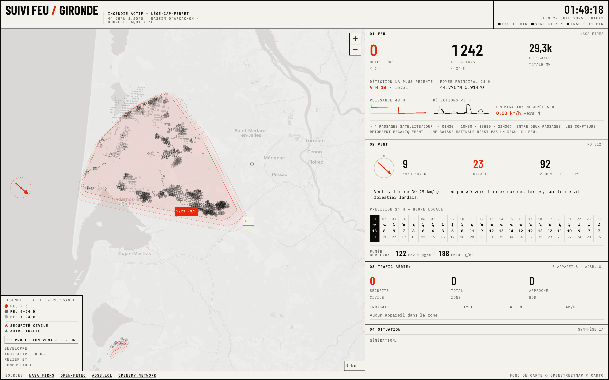
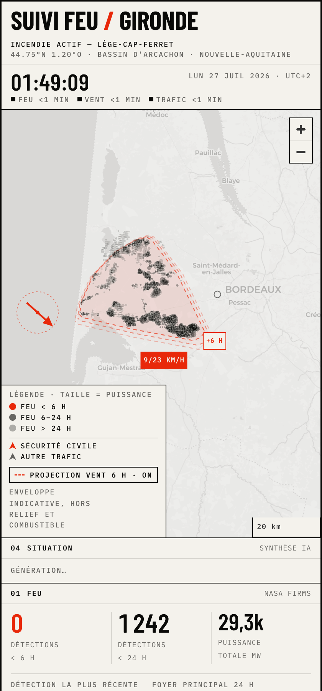
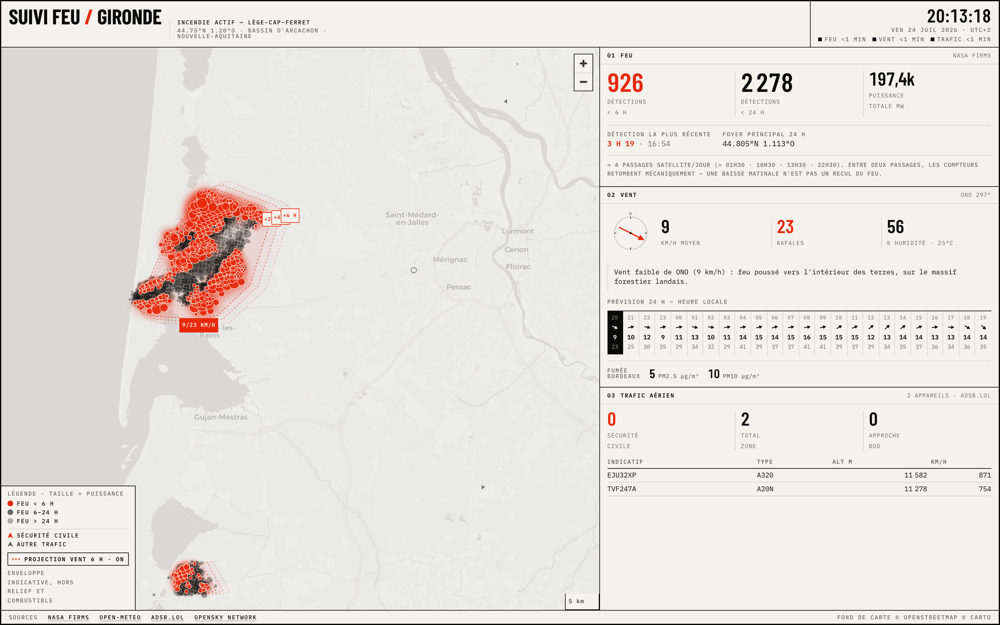
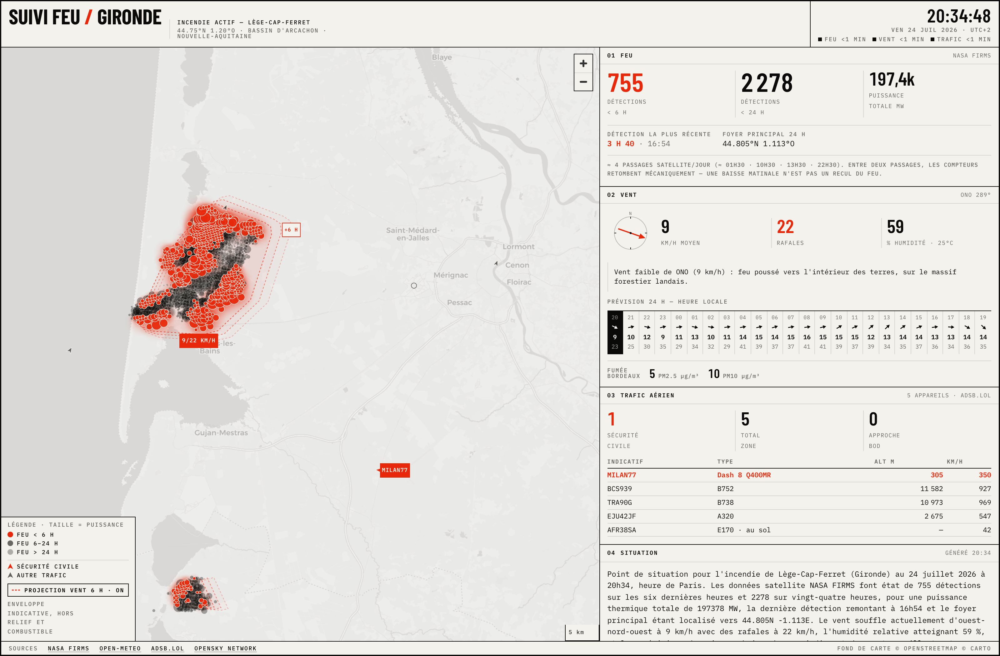
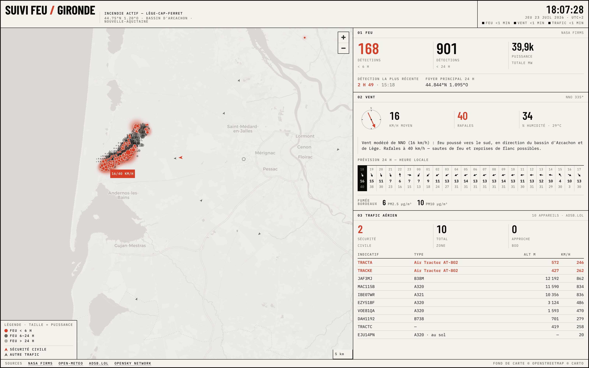

# SUIVI FEU / GIRONDE



Single-page fire situation tracker for the July 2026 wildfire near
Lège-Cap-Ferret, Gironde. Live satellite detections, wind, water bombers,
48 h history, and an AI-written French situation bulletin.

**Production:** https://gironde-fire-tracker.vercel.app

## The story

This project was built almost entirely by [Claude Code](https://claude.com/claude-code)
(Claude Fable 5), working from a design brief that was itself drafted with
Claude from a one-sentence idea. The human contribution: the brief, API keys,
a handful of authorizations, and two UX decisions. Everything else — code,
debugging, deployment, and the decisions in between — was autonomous, with
the whole first version live in under an hour.

- **Jul 23** — Brief → scaffold → five phases built, visually QA'd (three
  real bugs caught by screenshotting the running app), deployed to
  production in ~45 minutes of unsupervised work. OpenSky turned out to be
  unreachable from Vercel's egress; diagnosed live and swapped to adsb.lol,
  which incidentally enabled airframe-type detection of the Air Tractor
  water bombers that callsign matching missed.
- **Jul 24** — "Why does the fire look smaller in the morning?" → satellite
  sampling-cadence note + a wind-driven 6 h projection layer (per-fire
  clustering added the same day, when a second ignition broke the naive
  convex hull). Claude bulletin (module 04) and the history pipeline shipped
  that evening; two Supabase dead-ends later, history landed on Vercel Blob.
- **Jul 25–26** — The link spread through Bassin d'Arcachon Facebook and
  Instagram groups: **11,296 visitors in 24 h**, ~93 % France, ~95 % mobile,
  19–75 concurrently. Social preview card and mobile bulletin-first reorder
  shipped in response.
- **Jul 27** — **21,404 unique visitors in 72 h** — roughly the scale of the
  evacuated and directly threatened population, ~2.5× the population of
  Lège-Cap-Ferret itself. The same day, the tracker's own history modules
  documented the fire's collapse: total radiative power down from 197 GW to
  29 GW, measured spread 0.00 km/h.

Total infrastructure cost: ~free-tier everything except ~$1–3/day of Claude
API for the bulletin. The commit history is the honest build log — including
the failures and the fixes.

<p>
  
  
</p>

**Jul 24, the worst evening** — 755 detections in 6 h, 197 GW, and MILAN77
(a Dash 8 Q400MR water bomber) crossing the map at 305 m on its way back to
the fire line, while the Claude bulletin narrates below:



**Jul 23, day one** — two contracted Air Tractor AT-802 water bombers
(TRACTA, TRACKE) working the fire at under 600 m. Callsign matching missed
them; the airframe-type detection added that day caught them:



## Two distinct events

These are deliberately kept apart in the code and the UI:

1. **ACTIVE** — wildfire near Lège-Cap-Ferret (~44.75°N, -1.20°E). This is the
   fire being tracked.
2. **RESOLVED** — the 21 July fire at Bordeaux-Mérignac airport (BOD,
   44.828°N, -0.715°E). BOD appears on the map only as an air-traffic anchor
   (a plain ring), never as a fire feature.

Region of interest: lat 44.40 → 45.10, lon -1.45 → -0.40.

## Stack

Next.js (App Router) + TypeScript on Vercel. MapLibre GL with Carto Positron
raster tiles. Hand-rolled CSS — no component library, no gradients, no
shadows, no rounded corners. `maplibre-gl` is the only dependency beyond the
framework itself.

## Data sources

Every third-party API is proxied through a Next.js Route Handler. Nothing is
called from the client, so no key ever reaches the browser.

| Module | Route | Source | Cache |
| --- | --- | --- | --- |
| 01 FEU | `/api/fire` | NASA FIRMS (VIIRS NOAA-20, NOAA-21, MODIS) | 10 min |
| 02 VENT | `/api/wind` | Open-Meteo forecast + air quality | 15 min |
| 03 TRAFIC AÉRIEN | `/api/traffic` | adsb.lol (primary), OpenSky (fallback) | 60 s |
| 04 SITUATION | `/api/sitrep` | Claude (Anthropic API) over all sources | 15 min |
| — historique | `/api/history` + `/api/snapshot` | Vercel Blob | 5 min |

Each module fails independently: a source going down greys out only its own
frame and shows `SOURCE INDISPONIBLE`, and the last good payload stays on
screen rather than blanking. It never takes the page with it.

## Environment

Copy `.env.local.example` to `.env.local`.

- `FIRMS_MAP_KEY` — **required** for module 01. Free, instant email signup at
  https://firms.modaps.eosdis.nasa.gov/api/. Also set it in Vercel under
  Project Settings → Environment Variables.
- `ANTHROPIC_API_KEY` — required for module 04 SITUATION. The bulletin is
  generated by Claude (`claude-opus-4-8`, overridable via `SITREP_MODEL`) at
  most every 15 minutes; the module greys out without the key.
- `BLOB_READ_WRITE_TOKEN` — set automatically by linking a Vercel Blob store
  (`npx vercel blob create-store gironde-history --access public`). Enables
  the history features: sparklines, measured spread rate, trend in the
  bulletin. History is one rolling 48 h JSON document on Vercel Blob —
  public-access (it aggregates what the page already shows), written via
  plain fetch with the token server-side. Snapshots are taken
  opportunistically by `/api/history` while anyone has the page open, with a
  GitHub Actions cron (`.github/workflows/snapshot.yml`, every 30 min,
  `SNAPSHOT_SECRET` repo secret) as backstop for unwatched stretches; a
  12-min guard dedupes the two triggers. Everything degrades gracefully
  while unset.
- `SNAPSHOT_SECRET` — guards POST `/api/snapshot` (the backstop trigger).
- `OPENSKY_CLIENT_ID` / `OPENSKY_CLIENT_SECRET` — optional, and only useful
  where OpenSky is reachable (see below). Anonymous access works but is
  limited to roughly 400 credits/day.

Open-Meteo and adsb.lol need no key.

```bash
npm install
npm run dev
```

Note: `.npmrc` pins this project to the public npm registry, since the
machine default points at an internal registry that requires VPN.

### Why module 03 is not on OpenSky

OpenSky was the brief's air-traffic source, and it works from a laptop. It
does not work from Vercel: every OpenSky host TCP-times-out from Vercel's
egress (`UND_ERR_CONNECT_TIMEOUT`, ~10.5 s) while Open-Meteo answers in 83 ms
from the same function. OAuth2 credentials cannot fix it — `auth.opensky-
network.org` is unreachable too, so no token can be obtained — and calling it
from the browser instead is blocked by OpenSky's CORS policy, which allows
only its own origin.

So `/api/traffic` uses **adsb.lol** (free, no key, community ADS-B) as the
primary source and falls back to OpenSky automatically where it is reachable.
The live module header names whichever provider answered. adsb.lol also
reports the ICAO airframe type, which OpenSky does not.


## 04 SITUATION — the Claude bulletin

`/api/sitrep` hands Claude a compact summary of every live source (fire
counts and centroid, the 6 h wind forecast, which bombers are airborne,
measured spread when history exists) and gets back a 3–5 sentence French
situation bulletin. Guardrails: observations only — the prompt forbids spread
predictions, evacuation instructions and safety advice; the satellite-pass
sampling caveat is baked in so the model never reads a between-pass dip as
retreat; the module carries a permanent "SYNTHÈSE AUTOMATIQUE — INDICATIVE,
NON OFFICIELLE" attribution. Cost control: the route is dynamic (route-level
ISR would be clamped to the traffic handler's 60 s revalidate), cached at the
CDN with `s-maxage=900` plus a warm-instance memo, so Claude is called ~4×/hour
regardless of traffic.

## Projection layer

The map can overlay an indicative 6 h spread envelope (toggle in the legend,
on by default): detections from the freshest stratum are clustered into
distinct fires (single-linkage, 4 km), each cluster's convex hull is advected
hour by hour along the Open-Meteo forecast wind and slightly inflated so the
flanks widen as the head advances, and the +2/+4/+6 h fronts are drawn as
dashed outlines. Head rate of spread is ~5 % of a gust-weighted wind speed,
halved above 60 % humidity — a rule-of-thumb envelope, not a fire-behaviour
model (no fuel, no terrain), and it is labelled as such on the page.

## Notes on the data

- FIRMS returns two different CSV schemas — VIIRS reports `bright_ti4` and a
  categorical `l`/`n`/`h` confidence, MODIS reports `brightness` and a 0–100
  confidence. Both are normalised onto one scale.
- FIRMS `acq_time` is an HHMM integer with leading zeros dropped, so `105`
  means 01:05 UTC. It is padded before parsing.
- Detections below 30 confidence are dropped unless FRP ≥ 5, which cuts most
  bare-soil and industrial false positives around the estuary.
- Open-Meteo returns unzoned Europe/Paris wall-clock timestamps; the 24 h
  strip is aligned against a Paris wall-clock key, never a UTC instant.
- Firefighting aircraft are flagged by Sécurité Civile callsign prefix
  (PELICAN, MILAN, DRAGON, BENGAL) *and*, where the provider reports one, by
  airframe type. Callsign alone is not enough: on this fire the Air Tractor
  AT-802 water bombers were working the fire line as TRACTA/TRACTC/TRACKE,
  which match no Sécurité Civile prefix.
- Wind direction is reported as the direction wind comes *from*. The fire is
  driven toward `direction + 180`, which is what the arrow and the
  plain-language reading both show.
- Detection counts breathe with the satellite orbits, not only with the fire:
  ~4 passes/day (≈ 01:30, 10:30, 13:30, 22:30 local) means the "<6 h" figure
  decays mechanically through the morning, then jumps when the midday passes
  land. Module 01 says so on the page — a morning dip is not the fire
  shrinking.
- Timestamps are stored UTC and displayed Europe/Paris throughout.

## Attribution

NASA FIRMS · Open-Meteo · adsb.lol · OpenSky Network · basemap © OpenStreetMap
contributors © CARTO. FIRMS and OpenSky both require attribution; all sources
are credited in the page footer.
